# Merkle Airdrop & Signatures

## 📋 Project Overview

**Merkle Airdrop** is a smart contract system that enables efficient, cryptographically-secure token distribution to a large list of recipients using Merkle trees. Instead of storing all recipients in contract state (expensive), it uses Merkle proofs to verify that an address is part of an approved list. This allows anyone in the list to claim their tokens without requiring centralized coordination.

### Key Concept
- **Merkle Tree**: A binary tree where each leaf is a hash of data, and each node is a hash of its children
- **Merkle Proof**: A compact cryptographic proof that proves an element belongs to a Merkle tree
- **On-chain Verification**: Users provide their address, amount, and a Merkle proof to claim tokens

---

## 🏗️ Architecture & Logic Flow

```mermaid
graph TB
    A["📊 Input Data"] -->|address + amount| B["🔧 MakeMerkle.s.sol<br/>Merkle Proof Generator"]
    A -->|Input JSON| B
    
    B -->|Converts to bytes32| C["🌳 Merkle Tree Builder<br/>Murky Library"]
    C -->|Generates| D["📋 Merkle Proofs<br/>Merkle Root"]
    
    D -->|Output JSON| E["💾 Proof Database<br/>output.json"]
    
    E -->|Merkle Root| F["🪙 MerkleAirdrop Contract"]
    F -->|Stores immutably| G["Root: Merkle Root<br/>Token: ERC20 Token"]
    
    H["👤 Claim: User"] -->|address + amount + proof| I["🔐 Verify Claim<br/>Claim Function"]
    I -->|Hash user data| J["🔑 Generate Leaf"]
    J -->|Verify with proof| K{"✅ Proof Valid?"}
    
    K -->|Yes| L["✓ Mark Claimed<br/>Transfer Tokens"]
    K -->|No| M["✗ Revert: InvalidProof"]
    
    L -->|Emit Event| N["📢 Claim Event"]
    N -->|User receives| O["🎁 Token Claimed"]
    
    P["🪙 BagelToken<br/>ERC20"] -.->|Owned by| Q["Contract State"]
    Q -.->|Holds| R["Airdrop Tokens"]
```



### Component Flow:

1. **Off-chain Generation Phase**:
   - `input.json` contains eligible addresses and claim amounts
   - `MakeMerkle.s.sol` script reads input and builds Merkle tree using Murky library
   - Generates `output.json` with Merkle proofs, root, and leaf hashes for each address

2. **Contract Deployment Phase**:
   - Deploy `BagelToken` (ERC20) for the airdrop token
   - Deploy `MerkleAirdrop` with:
     - `merkleRoot` from generated output
     - `airdropToken` address (BagelToken)
   - Transfer airdrop tokens to MerkleAirdrop contract

3. **On-chain Claim Phase**:
   - User calls `claim(address, amount, merkleProof[])`
   - Contract:
     - Checks if user already claimed (prevents double claims)
     - Reconstructs leaf hash: `keccak256(keccak256(abi.encode(bytes32(address), bytes32(amount))))`
     - Verifies proof using OpenZeppelin's `MerkleProof.verify()`
     - Marks user as claimed
     - Transfers tokens to user

---

## 🔐 Security Features

| Feature | Purpose |
|---------|---------|
| **Double Keccak256 Hashing** | Prevents leaf preimage attacks |
| **Bytes32 Encoding** | Matches Merkle tree generation encoding |
| **CEI Pattern** | Checks-Effects-Interactions to prevent reentrancy |
| **SafeERC20** | Reverts on token transfer failures |
| **One-time Claims** | Mapping prevents duplicate claims |
| **Immutable Root** | Merkle root cannot be changed after deployment |

---

## ⚖️ Project Pros & Cons

| Aspect | Pros ✅ | Cons ❌ |
|--------|---------|---------|
| **Gas Efficiency** | O(log n) proof verification; minimal state storage | Requires off-chain computation |
| **Scalability** | Can handle thousands of recipients | Multiple function calls for verification |
| **Immutability** | Root hash cannot change (contracts security) | Cannot update eligibility after deployment |
| **Privacy** | Addresses don't need to be publicly listed | Proofs must be distributed separately |
| **Verification** | Cryptographically secure proofs | Requires correct encoding of leaf data |
| **User Experience** | One-click claiming for users | Users must obtain correct merkle proof |
| **Contract Size** | Minimal code footprint | External script dependency (Murky) |

---

### Potential Improvements:

1. **Multi-tree Support**: Allow multiple Merkle trees for different token releases
2. **Batch Claims**: Let users claim multiple token allocations in one transaction
3. **Proof Caching**: Store on-chain cache of used proofs to reduce computational overhead
4. **Withdrawal Function**: Allow contract owner to withdraw unclaimed tokens after deadline
5. **Signature Integration**: Combine with EIP-712 signatures for enhanced verification

---

## 📁 Project Structure

```
merkle-airdrop-and-signatures/
├── src/
│   ├── MerkleAirdrop.sol       # Main airdrop contract
│   └── BagelToken.sol          # ERC20 token for distribution
├── script/
│   ├── MakeMerkle.s.sol        # Merkle proof generator script
│   └── target/
│       ├── input.json          # Input data (addresses + amounts)
│       └── output.json         # Generated proofs + root
├── test/
│   └── MerkleAirdrop.t.sol     # Test suite
├── lib/
│   ├── forge-std/              # Foundry standard library
│   ├── murky/                  # Merkle tree library
│   └── openzeppelin-contracts/ # OpenZeppelin contracts
└── foundry.toml                # Foundry configuration
```
